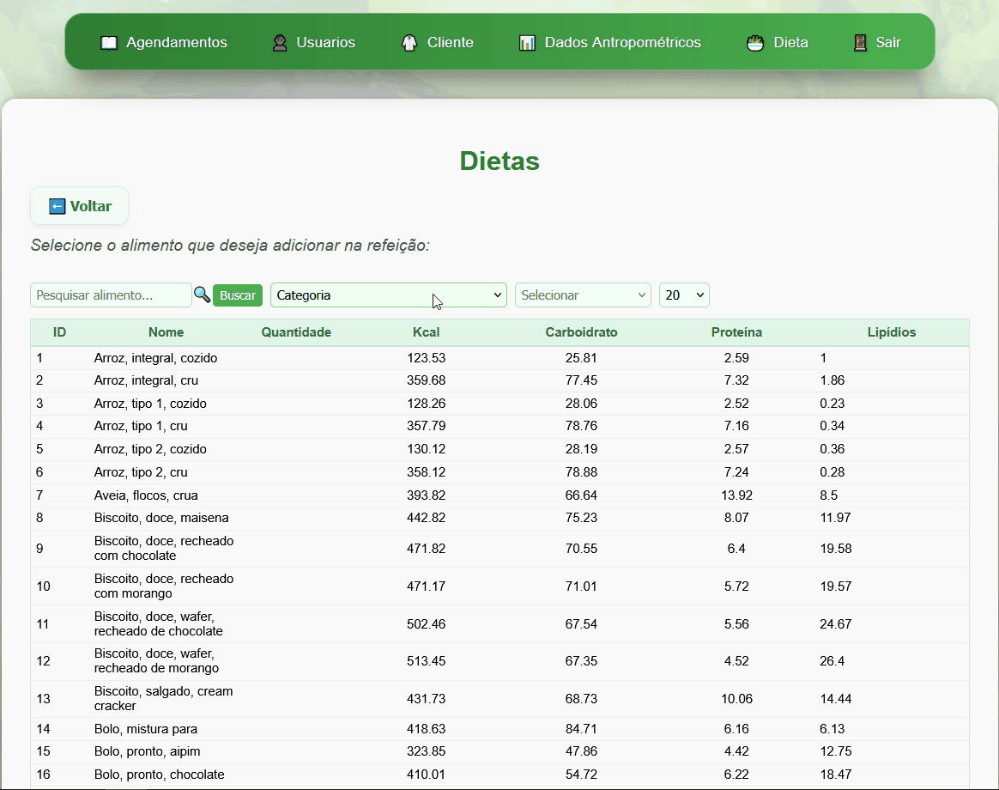
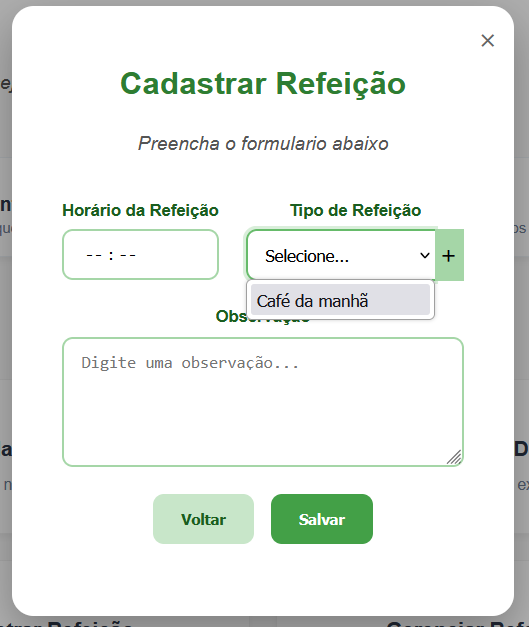

# 🥗 NutriSystem Fullstack - Gestão de Nutrição

Este projeto é um ecossistema completo para gestão nutricional, unindo um **Frontend em Next.js**, um **Backend em Spring Boot** e uma infraestrutura orquestrada via **Docker Swarm**.

Desenvolvido originalmente para atender às demandas clínicas de uma **nutricionista parceira**, o projeto foca na automatização do consultório e na experiência do usuário. O sistema permite que o profissional gerencie o ciclo completo de atendimento, enquanto o **cliente final pode acessar exclusivamente seus dados, dietas e relatórios** para acompanhamento da evolução.

---

## 🏗️ Diferenciais de Arquitetura e Segurança

### 🛡️ Gestão Híbrida de Configurações
Desenvolvi um **provedor de configurações híbrido** para a aplicação. Ele prioriza a leitura de **Docker Secrets** para garantir a segurança máxima em ambiente de produção (VPS), mantendo um *fallback* inteligente para Variáveis de Ambiente. Isso facilita o desenvolvimento local sem nunca expor credenciais sensíveis no código-fonte.
> **Resiliência:** Caso as credenciais críticas não sejam encontradas, a inicialização é interrompida imediatamente para evitar que a aplicação rode em estado inválido.

### 🐳 Isolamento de Rede e Banco de Dados
O banco de dados PostgreSQL é gerenciado de forma independente via **Docker Service**.
- **Isolamento:** A porta 5432 não é exposta para a internet.
- **Comunicação Interna:** A API e o Banco comunicam-se exclusivamente através da rede `network-nutri` em modo *overlay*.

### 🔐 Segurança no Frontend e Comunicação
- **HTTPS Real em Dev:** Utilizei o `mkcert` para gerar certificados TLS confiáveis localmente, permitindo que o Next.js rode em HTTPS real, simulando perfeitamente o ambiente final com certificados *Let's Encrypt*.
- **Hardening:** Implementação de políticas de **Content Security Policy (CSP)** e sanitização rigorosa de HTML para neutralizar vetores de ataque como XSS e SQL Injection.

---

## 🛠️ Stack Tecnológica

| Camada | Tecnologias |
| :--- | :--- |
| **Frontend** | Next.js, Lucide Icons, Zustand |
| **Backend** | Java 21, Spring Boot 3.4, Spring Security + JWT, Hibernate |
| **Banco de Dados** | PostgreSQL 16.10 (Trixie) |
| **Infra** | Docker Swarm, Docker Secrets, WSL2 (Ubuntu) |

---

## 📈 Roadmap e Estado Atual (MVP)

Atualmente, o projeto encontra-se em fase de **MVP (Produto Mínimo Viável)**. O fluxo principal de autenticação, persistência e segurança de dados já está consolidado.

**Próximos passos no cronograma:**
- [ ] Adicionar relatório completo da dieta para o cliente.
- [ ] Refatoração das validações de negócio para reduzir chamadas redundantes ao banco (Otimização de I/O e custo de requisições).
- [ ] Ampliação da cobertura de testes unitários e de integração.
- [ ] Padronização da Camada de Modelo (POJOs): Migrar atributos para camelCase no Java
- [ ] Correções conforme as necessidades.

---

## 🚀 Guia de Operação e Deploy

Para facilitar a análise técnica, a documentação foi dividida em guias especializados:

1. 🐳 **[Infraestrutura e Docker Swarm](./backend/docs/DOCKER_SWARM_GUIDE.md)**: Guia completo de criação de redes, segredos e serviços.
2. 🗄️ **[Gestão de Dados](./backend/scripts/)**: Scripts SQL de inicialização e importação massiva via CSV.
3. 🛠️ **[Automação de Deploy](./backend/scripts/deploy_commands.sh)**: Script Shell para provisionamento rápido do ambiente.

---

## 💡 Mentalidade de Desenvolvimento

Este projeto foi construído utilizando AI Pair-Programming como suporte em todo o ciclo de desenvolvimento. Mais do que auxiliar na escrita de código, a IA atuou como um acelerador técnico para:

  **- Arquitetura e Segurança:** Refinamento do Spring Security, uso de Docker Secrets e auditoria de políticas contra ataques comuns.

  **- Infraestrutura:** Apoio na orquestração do Docker Swarm e configuração de redes isoladas.

  **- Decisões de Design:** Validação de padrões no Spring Boot e otimização da experiência do usuário no Next.js.

O objetivo foi garantir uma entrega madura, resiliente e pronta para escala real em ambiente de nuvem.

---

## 📺 Demonstração em Vídeo (MVP)

Abaixo, você pode conferir as principais funcionalidades do **NutriSystem** em operação, integrando o ecossistema Next.js + Spring Boot.

### 🍏 Gestão de Alimentos e Dietas
| Cadastro de Alimento | Montagem da Dieta |
| :---: | :---: |
|  |  |
| *Interface rápida para novos insumos* | *Gerenciando refeições personalizadas por paciente.* |

### 📊 Inteligência de Dados
| Relatório e Dados do Paciente | Cadastro de Refeição (UI) |
| :---: | :---: |
|  |  |
| *Processamento de indicadores nutricionais* | *Preview da interface de horários* |

---

**Desenvolvido por Guilherme Corrêa**
